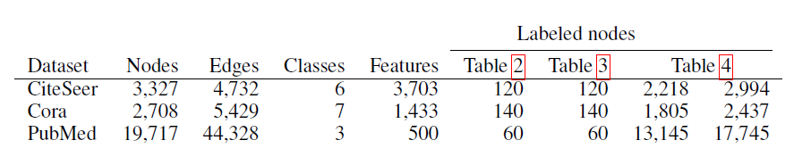
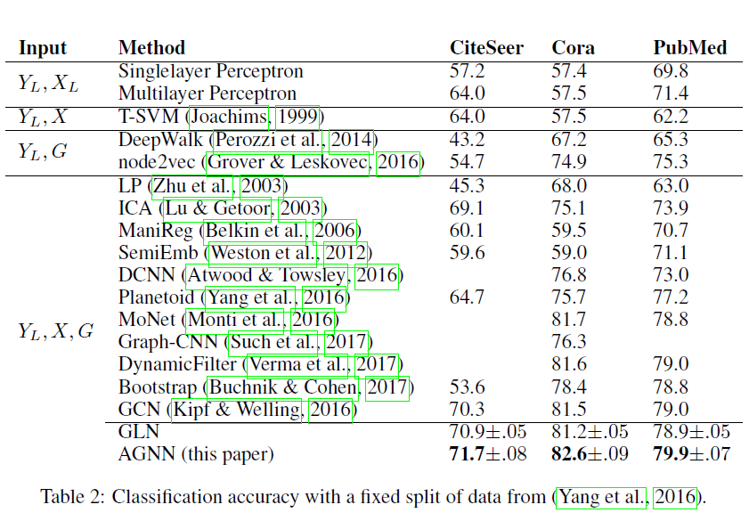
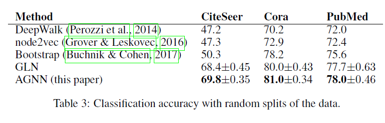
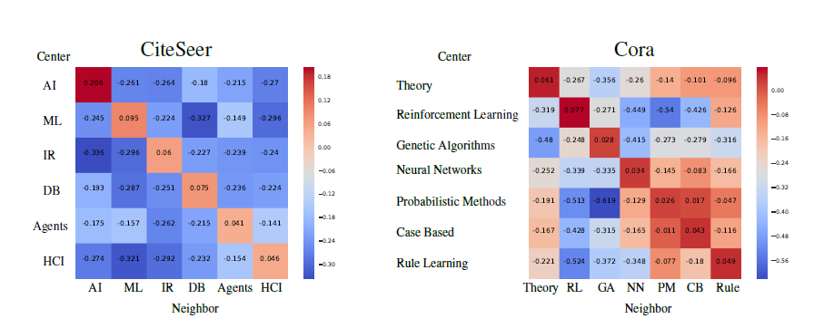

# ATTENTION-BASED GRAPH NEURAL NETWORK FOR SEMI-SUPERVISED LEARNING

[TOC]

> 这是一篇发表在ICLR2018的文章。

## ABSTRACT

近段时间，graph neural networks（GNN）在一系列公开的基于图的半监督任务中表现出了不俗的性能。那些架构都是交替使用**融合邻居节点隐藏状态的传播层**和**全连接层**。本文提出的一种去除所有中间的全连接层的线性模型的表现依旧能与最优的模型媲美。这个模型能能减少参数量，这对样本较少的半监督学习任务来说具有重要意义。这种新的GNN同时也结合了注意力机制。

## INTRODUCTION

这篇论文关注点在于那些图结构中的未标记的数据。一个图包含数据点之间本质的关系，而这些关系不一定都是标记好的。论文拿一个引文网络举例，图中节点是有bag-of-words的feature vector表示，每条edge表示一个引用关系，同样也会隐含一种作者和其他引文之间的关系，这些关系不能由单独的bag of words 的feature vector推断出来。例如社交网络、购物记录、观影历史，都有这样的性质，特征向量不足以表示图结构所富含的丰富意义。基于图的半监督学习任务是使用一小部分标记节点和所有节点特征来对节点分类。GNN作为一种新的神经网络在一系列标准数据集中有重要的提升。这篇论文提出使用注意力机制来聚合邻居信息。论文模型主要有三方面优势：

* 极大减少了模型复杂度；
* 动态自适应发现节点之间关系；
* 进一步提高了在标准数据集上的准确率；

## RELATED WORK

### Graph Laplacian regularization

一般的，一个图中的临近节点更有可能有同样的label，整个图的信息可以这样表示：
$$
\mathcal{L}\left(X, Y_{L}\right)=\mathcal{L}_{\text { label }}\left(X_{L}, Y_{L}\right)+\lambda \mathcal{L}_{G}(X)
$$
其中LG是基于图的正则项，称为拉普拉斯正则化。

### Unsupervised node embedding for semi-supervised learning

目前已经有几种使用连接来做隐式欧几里德空间的node embedding。通过学习到的embedding，就可以通过标准的监督学习来训练模型。word2vec、DeepWalk、node2vec、LINE等等。这些方法的优势在于其普遍性，这也是它们针对特定任务的缺陷所在。

### Graph Neural Network (GNN)

GNN是神经网络图结构化的扩展，或者说是CNN、RNN的一种扩展。通常，信息聚合是依据一些神经网络结构迭代进行的。模型参数通过监督、半监督方式的来训练的。实际上，GNN已经得到了广泛的应用。论文接下来先会先介绍GCN来对比论文方法。

## DISSECTION OF GRAPH NEURAL NETWORK

论文提出一种新的基于GNN的模型，*Attention-based Graph Neural Network* (**AGNN**)。模型**Z**的定义如下：
$$
Z=f(X, A)
$$
其中，**X**是节点特征，**A**是graph的邻接矩阵。

通常，典型的GNN模型前向通道是传播层和单层感知器交替使用。一个传播矩阵**P**的传播层可以这样定义：
$$
\tilde{H}^{(t)}=P H^{(t)}
$$
其中，
$$
P=D^{-1} A  ，\tilde{H}_{i}^{(t)}=(1 /|N(i)|) \sum_{j \in N(i)} H_{j}^{(t)}，D=\operatorname{diag}(\mathrm{A} \mathbb{1})
$$

GNN通过传播层对图结构进行编码，这也可以看作是一个图卷积操作。紧接着，一个单层的感知器应用于每个node，并且权重***W***(t)是共享的，这就大大减少了要训练的参数量：
$$
H^{(t+1)}=\sigma\left(\tilde{H}^{(t)} W^{(t)}\right)
$$

### Graph Convolutional Network (GCN)

GCN是Kipf & Welling 2016年提出的一种简单且有效的结构。事实上，GCN可以算是GNN的一个特例，下面是GCN的定义：
$$
H^{(1)}=\operatorname{ReLU}\left((P X) W^{(0)}\right)
$$

$$
Z=f(X, A)=\operatorname{softmax}\left(\left(P H^{(1)}\right) W^{(1)}\right)
$$

其中，
$$
P=\tilde{D}^{-1 / 2} \tilde{A} \tilde{D}^{-1 / 2}
$$

经过*softmax*即可得到一个*dy*维度的概率预测结果。这里用cross-entropy来训练**W(0)**、**W(1)**：
$$
\mathcal{L}=-\sum_{i \in L} \sum_{c=1}^{d_{y}} Y_{i c} \ln Z_{i c}
$$

### Graph Linear Network (GLN)

为了更好的理解GCN，论文移除中间的非线性激活单元，得到Graph Linear Network，定义如下：
$$
Z=f(X, A)=\operatorname{softmax}\left(\left(\mathrm{P}^{2} \mathrm{X}\right) \mathrm{W}^{(0)} \mathrm{W}^{(1)}\right)
$$
跟上面GCN参数一样。通过两层度数加权的原始特征均值和一个简单线性分类器，既可以分离线性传播层的非线性感知层的增益。

通过比较发现，GLN能够达到GNN的准确度，某些情况甚至更好。这就说明了GNN结构的优势在于传播层，而感知层对结果的影响并不大。同时，这也是那些没有使用graph的模型的缺陷所在。基于这个发现，论文提出来基于attention mechanism的替代GLN的传播层。

## ATTENTION-BASED GRAPH NEURAL NETWORK (AGNN)

原始的GCN层都是静态的、非自适应的。这种传播层对于确定邻居node与目标node哪个更相关，在真实世界中并不是所有的关系都是一模一样的。

我们需要一种能够满足上述需求的动态传播层，但是，使用半监督学习来训练如此复杂的GCN并不简单。由于数据标记样本较小，如下图所示，实验结果也显示在这种数据集下，GCN效果并没有本文的模型效果好。

### AGNN MODEL

首先使用一个word-embedding层来将一个文档的bag-of-words转换为averaged word embedding，这部分同样会被训练：
$$
H^{(1)}=\operatorname{ReLU}\left(X W^{(0)}\right)
$$
接下来，是attention-guided propagation层，每层的定义如下：
$$
H^{(t+1)}=P^{(t)} H^{(t)}
$$

$$
P_{i}^{(t)}=\operatorname{softmax}\left(\left[\beta^{(t)} \cos \left(H_{i}^{(t)}, H_{j}^{(t)}\right)\right]_{j \in N(i) \cup\{i\}}\right)
$$

$$
P_{i j}^{(t)}=(1 / C) e^{\beta^{(t)} \cos \left(H_{i}^{(t)}, H_{j}^{(t)}\right)}
$$

这里的***P***是一个关于***H***的函数，最后的关于node *i* 的输出如下：
$$
H_{i}^{(t+1)}=\sum_{j \in N(i) \cup\{i\}} P_{i j}^{(t)} H_{j}^{(t)}
$$
最后的输出层有一个权重***W1***：
$$
Z=f(X, A)=\operatorname{softmax}\left(H^{(\ell+1)} W^{(1)}\right)
$$
其中，***W0***、***W1***和*β*使用交叉熵来训练。论文还强调其应用的neighborhood attention跟其他论文是不同的应用。主要区别在于，AGNN一个图中的节点间的neighborhood注意力，而其他应用则是基于所有实体构建的一个”soft neighborhood“。

## EXPERIMENTS ON BENCHMARK CITATION NETWORKS

论文在三个引文数据集上使用半监督学习任务来测试模型。每个引文数据集以文档作为node、引用关系作为edge。每个node都有一个class和feature vector。

论文针对数据集的固定划分、随机划分以及大规模数据集分别做了实验，可以看出AGNN的效果都很好，实验结果如下：

### QUALITATIVE ANALYSIS

将attention 融入一个模型可以使模型具有某种形式的解释性。***P(t)ij***可以说明node *j* 与node *i* 的相关程度。论文还定义了node 所属topic *c1*和*c2*的相关度，如下：
$$
Relevance\left(c_{2} \rightarrow c_{1}\right)=\frac{1}{\left|S_{c_{1}, c_{2}}\right|} \sum_{(i, j) \in S_{c_{1}, c_{2}}} R(j \rightarrow i)
$$
依据edge的相关分数定义如下：
$$
R(j \rightarrow i)=\left(P_{i j}^{(t)}-\frac{1}{|N(i)|+1}\right) / \frac{1}{|N(i)|+1}
$$
下图展示了数据集CiteSeer和Cora的相关度分数。

接着，论文分析了edge评分高低的结果，通过对比top 100 和bottom100的edge score，下表可以看出同类node有更高的attention值。

最后论文还分析了那些GCN分类错误但是AGNN分类正确的样例。下图是一些例子，并进一步做了一些分析。

## 论文地址

[ATTENTION-BASED GRAPH NEURAL NETWORK FOR SEMI-SUPERVISED LEARNING](https://arxiv.org/pdf/1803.03735.pdf): https://arxiv.org/pdf/1803.03735.pdf

