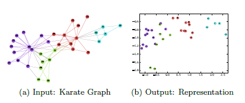

## DeepWalk: Online Learning of Social Representations

>经典的Graph Embedding的文章，发表于2014 KDD上。

## ABSTRACT

论文提出了**DEEPWALK**之中模型，用来学习网络中节点的隐含表示。DeepWalk从NLP而来，将NLP中的单词序列概括到图上。实验证明，模型取得了很好的效果，DeepWalk是一种在线、可扩展、并行的学习方法，很适合应用在在network classification, anomaly detection。

## INTRODUCTION

**DeepWalk**通过构建的short random walk流学习Graph中顶点的social representation。Social representations是关于顶点的邻居相似性、社区关系的一种隐含的特征表示，通过对上述关系的编码得到一种低维的、具有丰富含义的向量表示，我感觉就是现在所说的embedding vector，所谓的social representation也就是embed的过程。DeepWalk以一个graph作为输入，embedding vector作为输出。下图是一个例子：

为了证明模型的效果，论文通过在large heterogeneous graphs上的多分类任务进行评估。本文的贡献如下：

* 使用深度学习分析图数据构建一种具有广泛适用性的健壮的表示；
* 在多个数据集上的多分类任务中对模型进行评估；
* 证明了模型在大规模网络图数据中的适用性，并分析了对于处理流数据模型要做的微小变化；

## PROBLEM DEFINITION

一般的，$G = （V，E）$，$V$是网络中的成员（节点），$E$是网络中的边，$E \in （V * V）$。定义一个部分标记的的社交网络$G_L = (V,E,X,Y)$，其中属性$X \in \mathbb{R}^{|v|*S}$，

