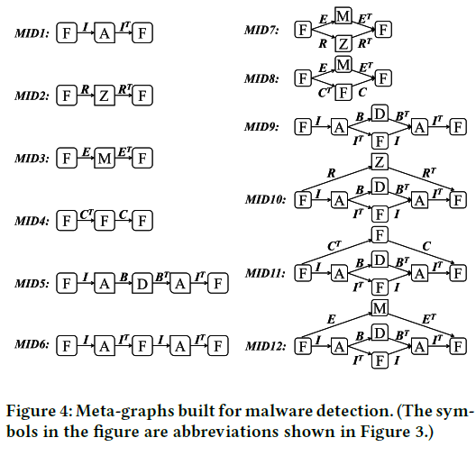
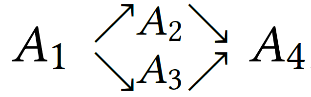
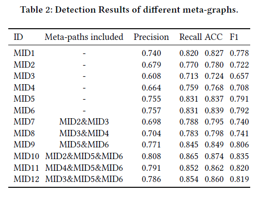
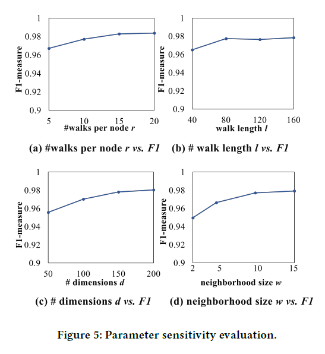
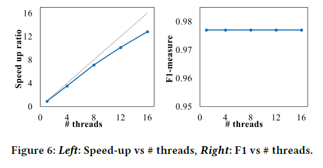
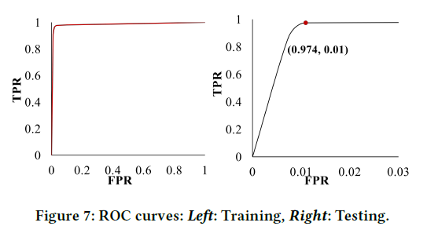
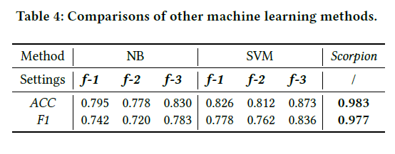
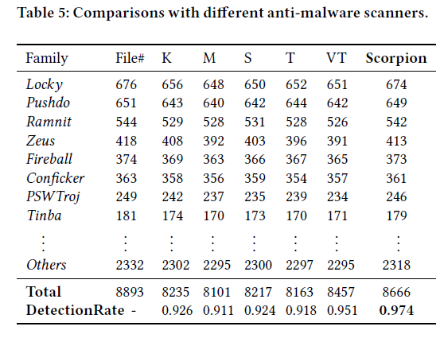

# Gotcha - Sly Malware! Scorpion: A Metagraph2vec Based Malware Detection System 

> 基于Metagraph2vec的恶意软件检测系统，发表于2018年KDD会议。

[TOC]

## ABSTRACT

恶意软件检测越来越得到人们的重视，针对恶意软件检测，论文提出了Scorpion系统。论文使用内容特征和关系特征作为，针对多种类型的实体，论文构建出一个HIN并提出一个新的节点表示方法——metagraph2vec。通过在来自于Comodo Cloud Security Center的数据上的实验，证明Scorpion模型优于其他恶意软件检测技术。

## INTRODUCTION

这部分首先介绍了什么是恶意软件，恶意软件会做些什么，以及恶意软件对社会造成的严重后果。因此引出了恶意软件检测，介绍了一下反恶意软件的现状，并指出**传统的恶意软件检测方法忽视了样本文件间重要的关系信息，即使有些方法有考虑文件间的关系，也只是单独的一种关系**。还有，论文还指出**单单只使用文件内容特征或文件关系特征很可能存在漏洞**，并详细给出了一些例子。

为了解决上述的问题，面对多种复杂的关系，论文使用HIN来表示，并使用基于meta-graph的方法结合高级的语义来表示文件相关性。恶意软件检测是一个速度敏感的应用，大多数神经网络挖掘方法都需要很大的计算量，论文结合神经网络嵌入技术提出了新的HIN embedding的方法metagraph2vec，以最大限度保留结构特征和语义特征。基于这个方法添加一个分类器即可用来检测恶意软件。论文的主要特点有一下这些：

* 使用新的特征表示方法来检测恶意软件，同时使用content-based features和relation features；

* 提出了有效的HIN表示方法，论文基于meta-graph提出新的HIN embedding模型metagraph2vec，并且metagraph2vec是一个通用的框架，可以应用与多种神经网络挖掘任务；
* 为反恶意软件行业开发了实用的系统，在实际的应用中得到了充分的检验；

## SYSTEM ARCHITECTURE

整个系统架构如图，包含如下部分：

* 数据收集；
* 特征提取，首先从收集的特征中提取content-based特征，之后分析不同类型实体间的关系；
* HIN上meta-graph构建，构建出一个包含各种实体的HIN来抓取不同文件之间的关系特征；
* metagraph2vec，基于meta-graph网络结构提出了metagraph2vec，用于整合不同节点间语义信息和结构信息，random walk获取上下文后，使用skip-gram学习节点表示，使用多角度融和算法整合学习到的不同meta-graph的表示；
* 恶意软件检测，使用支持向量机实现分类；

## PROPOSED METHOD

这部分主要介绍模型细节，论文如何同时整合content- and relation-based特征，如何基于节点表示来检测恶意软件。

### Feature Extraction

#### Content-based Features

Windows API接口能有效的反映程序行为。论文从Import Tables中抽取Windows API接口作为content-based特征。

#### Relation-based Features

尽管基于内容的特征能够用来表示一个文件的行为，为了捕捉到一些特殊恶意软件，这些恶意软件和相关软件的固定、复杂的关系对检测有重要作用。为了识别复杂的恶意软件，除了content-based特征，也应该考虑relation-based特征。文件之间的关系主要有以下的定义：

* **R1**：file-replace-archive
* **R2**：file-exist-machine
* **R3**：file-create-file
* **R4**：file-include-API
* **R5**：API-belongto-DLL

### Meta-graph Based Relatedness

为了描述不同类型的实体及其之间的关系（**R1-R5**），论文使用了HIN，HIN可以包含不同类型的实体和关系。

#### Heterogeneous information network（HIN）

一个HIN定义为一个图$\mathcal{G}=(\mathcal{V},\mathcal{E})$，这个图包含一个实体类型映射函数：$\phi : \mathcal{V} \rightarrow \mathcal{A}$和一个关系类型映射函数：$\psi : \mathcal{E} \rightarrow \mathcal{R}$，其中$\mathcal{V}$表示实体集合，$\mathcal{E}$表示关系集合，$\mathcal{A}$表示实体类型集合，$\mathcal{R}$表示关系类型集合，并且存在实体类型$|\mathcal{A}|>1$或者关系类型$|\mathcal{R}|>1$。一个图的**network schema**表示为$\mathcal{T}_\mathcal{G}=(\mathcal{A},\mathcal{R})$，图中的节点类型来自于$\mathcal{A}$，边类型来自于$\mathcal{R}$。下图是论文构建的HIN的network schema。

HIN可以描述数据的网络结构和类别的高级抽象。本文中的数据包含了5种实体类型和5种关系类型，这种复杂的网络结构促使我们使用一种计算机可以理解的表示方式来表示这些不同实体间的语义关系。于是有了**meta-path**的概念：一条meta-path $\mathcal{P}$ 是network schema上的一条路径，表示为$A_{1} \stackrel{R_{1}}{\longrightarrow} A_{2} \stackrel{R_{2}}{\longrightarrow} \ldots \stackrel{R_{L}}{\longrightarrow} A_{L+1}$，我们可以认为这是实体类型$A_1$和$A_{L+1}$之间存在一种综合的关系$R=R_{1} \cdot R_{2} \cdot \ldots \cdot R_{L}$，$·$ 表示关系合成的操作，$L$是路径$\mathcal{P}$的长度。一个论文数据集中典型的例子$F \stackrel{\text {includes}}{\longrightarrow} A \stackrel{\text {includes}^{-1}}{\longrightarrow} F$，表示两个文件之间由于import了相同的API而产生的一种联系。尽管meta-path能够抽取HIN中实体之间的关系，但是对于复杂的关系（例如两个文件总是在相同的文档中被替换，并且它们有相同的APIs，而这些APIs在相同的DLL中，并且会同时被程序调用）。这就需要一种更好的表征方式来处理这样的复杂关系，这就是**Meta-graph**，它使用一个有向无循环图和关系类型来处理具有复杂关系的两个HIN实体。

#### Meta-graph

一个**meta-graph** $\mathcal{M}$是一个定义在HIN上的包含起点$n_s$和一个目标点$n_t$的有向无循环图。通常一个meta-graph被定义为$\mathcal{M}=(\mathcal{V}_M,\mathcal{E}_M,\mathcal{A}_M,\mathcal{R}_M,n_s,n_t)$，其中$\mathcal{V}_{M} \subseteq \mathcal{V}$​，$\mathcal{E}_M \subseteq \mathcal{E}$分别受限于$\mathcal{A}_M \subseteq \mathcal{A}$和$\mathcal{R}_M \subseteq \mathcal{R}$。

基于HIN的network schema结合领域知识，论文整合了12个有意义的meta-graph来表示文件之间的关系。事实上，一个meta-path是一个meta-graph的特殊例子，不同的meta-graph从不同的角度衡量了两个文件的关系。恶意软件检测是速度敏感的应用，且需要经济适用的解决方案，这就需要一种可扩展的HIN表示学习方法。

### Metagraph2vec	

#### HINRepresentation Learning

给定一个HIN $\mathcal{G}=(\mathcal{V},\mathcal{E})$，表示学习任务是学习一个函数$f : \mathcal{V} \rightarrow \mathbb{R}^{d}$能够映射节点$v \in \mathcal{V}$为一个$d$维的向量空间$\mathbb{R}^d$，$d \ll|\mathcal{V}|$且能够保留节点间的结构信息和语义关系。由于HIN的异构属性，很难直接应用同构的卷积网络技术去学习这个表示。metapath2vec是基于meta-path的random walk和异构的skip-gram来学习HIN节点的隐含表示，但是对于具有更复杂关系的meta-graph，这就需要一种新的HIN隐含表示方法——metagraph2vec。首先，使用random walk映射文本语料库中词语文本中的概念到一个HIN；接着，使用skip-gram取学习这个HIN的节点表示；之后，使用一个多角度融和函数融和基于不同meta-graph的节点表示。

#### Meta-graph Guided Random Walk

传统的random walk是随机选择节点$v_k$的邻居的过程，这个第$i$步的过渡概率$p\left(v_{j}^{i+1} | v_{j}^{i}\right)$是服从忽略节点类型的正态分布。这种机制并不能抓住HIN节点中相关的语义和结构信息。这里论文使用了meta-graph to guide random walk来多种类型节点的路径。给定一个图和一个meta-graph $\mathcal{M}$ 如下图：

设置$walker-u$和$walker-v$来游走HIN。第$i$步的转移概率定义如下：
$$
p_{1}\left(u^{i+1} | u^{i}, \mathcal{M}\right), p_{2}\left(v^{i+1} | v^{i}, \mathcal{M}\right)\\
\begin{equation}
=\left\{
\begin{aligned}
\frac{1}{\left|N_{A_{t}}\left(u^{i}\right)\right|}, \frac{1}{\left|N_{A_{1}^{\prime}}\left(v^{i}\right)\right|}, \qquad \qquad if\left(u^{i}, u^{i+1}\right) \in E,\left(v^{i}, v^{i+1}\right) \in E, \phi\left(u^{i+1}\right) \neq \phi\left(v^{i+1}\right)\\
\frac{1}{\left|N_{A_{t}}\left(u^{i}\right) \cap N_{A_{t^{\prime}}\left(v^{i}\right)}\right|}, \frac{1}{\left|N_{A_{t}}\left(u^{i}\right) \cap N_{A_{t^{\prime}}}\left(v^{i}\right)\right|},\ if \left(u^{i}, u^{i+1}\right) \in E,\left(v^{i}, v^{i+1}\right) \in E, u^{i+1}=v^{i+1}\\
0,0 \qquad\qquad\qquad\qquad\qquad\qquad\qquad\qquad\qquad\qquad\qquad \qquad\qquad\qquad otherwise.
\end{aligned}
\right.
\end{equation}
$$
其中$\phi$是节点映射函数，$N_{A_{t}}\left(u^{i}\right)$和$N_{A_{t^{\prime}}}\left(v^{i}\right)$分别表示节点$u^i$和$v^i$类型分别为$A_t$和$A_{t'}$的邻居。如果$walk-u$和$walk-v$相同，meta-graph guided random walk 可以被考虑为基于meta-path的random walk。生成的路径可以进一步放入skip-gram。

#### Skip-gram

一个路径实例对应一个文本上的句子，一个节点对应一个文本上的词，skip-gram算法用于最大化以当前表示为条件的节点的邻居的概率（在$w$的范围内），skip-gram的目标函数为：
$$
\arg \max _{Y} \log \sum_{-w \leq k \leq w, j \neq k} p\left(v_{j+k} | Y\left(v_{j}\right)\right)
$$
$Y(v_j)$节点$v_j$当前的表示，$p\left(v_{j+k} | Y\left(v_{j}\right)\right)$使用softmax函数来定义：
$$
p\left(v_{j+k} | Y\left(v_{j}\right)\right)=\frac{\exp \left(Y\left(v_{j+k}\right) \cdot Y\left(v_{j}\right)\right)}{\sum_{q=1}^{|V|} \exp \left(Y\left(v_{q}\right) \cdot Y\left(v_{j}\right)\right)}
$$
首先应用上式的softmax，之后使用SGD来训练skip-gram。

#### Multi-view Fusion

给定一个meta-graph，通过上面的方法，能够学到HIN中节点的表示。因为有12个meta-graph，不同的meta-graph会产生不同的表示，这就需要使用一个多角度的函数来融和不同的表示结果。有$m$种节点表示，节点表示的融和可以表示为：$Y^{\prime}=\alpha_{i} \times Y_{i}$，其中$\alpha_i$是$Y_i$的权重，论文通过几何距离来确定每个权重的大小。相同维度向量空间的principal angle有重要的描述作用，这个principal angle别定义为：
$$
\cos \theta=\max _{\mathbf{y} \in Y_{i}, \mathbf{y}^{\prime} \in Y_{j}} \mathbf{y}^{T} \mathbf{y}^{\prime}
$$
当$Y_{i} \cap Y_{j} \neq 0$时$angle \theta=0$，当$Y_{i} \perp Y_{j}$时，$\theta=\frac{\pi}{2}$。$\theta_{1}, \theta_{2}, \ldots, \theta_{d}$是$Y_i$和$Y_j$的$d$个principal angles。它们的几何距离就可以定义为：
$$
d\left(Y_{i}, Y_{j}\right)=\sqrt{\theta_{1}^{2}+\theta_{2}^{2}+\ldots+\theta_{d}^{2}}
$$
因此，就可以计算每个向量空间$Y_i$的权重$\alpha_i$了：
$$
\alpha_{i}=\frac{\sum_{j=1, i \neq j}^{m} d\left(Y_{i}, Y_{j}\right)}{\sum_{i=1}^{m} \sum_{j=1, i \neq j}^{m} d\left(Y_{i}, Y_{j}\right)}
$$

## EXPERIMENTAL RESULTS AND ANALYSIS

论文使用真实的数据集进行了五组实验，全面的评价了Scorpion的性能。

### Experimental Setup

主要介绍了实验用数据集，以及评估指标信息。

### Evaluation of  Different Meta-graphs

基于数据集，这部分实验评估了根据不同meta-graph抽取不同关系（**MID1-MID12**）的性能。给定一个meta-graph使用random walk的方法学习节点的低维表示，然后使用SVM进行恶意软件分类。实验结果如下图：

从表中可以看出不同的meta-graph有着不同的表现，这是因为它们在反恶意软件领域中都有着特定的语义。从上表中，我们可以发现这些：

* content-based特征好于relation-based的特征；
* 基于meta-graph情况由于基于meta-path的情况；

### Evaluation of Metagraph2vec

这部分的实验，论文评估了metagraph2vec的方法，通过对比一些神经网络表示方法：DeepWalk，LINE和metapath2vec。对于DeepWalk和LINE，论文忽略了数据的异构属性，对于metapath2vec，MID1-MID6同样被考虑进去。所有的方法都是用SVM来进行最后的分类。下表结果证明metagraph2vec对比其他的baseline有明显的性能提升。并进一步分析了metagraph2vec效果好的原因，主要是使用了HIN以及使用了meta-graph guided random walk。同时也证明了多角度的融和算法有助于提升检测性能。

### Evaluation of Parameter Sensitivity, Scalability and Stability

这部分实验主要分析了参数的灵敏度、可扩展性和稳定性。首先是灵敏度，分析了每个结点walker的数量$r$和步长$l$，结果如下图图表$a$、图表$b$。图表$c$则分析了维度对性能的影响，图表$d$分析了邻居节点数量对性能的影响。

紧接着，论文分析了metagraph2vec的可扩展性，实验对比线程数对计算速度的影响，以及线程数对结果的影响。结果如下图：

最后是稳定性的评估，从ROC曲线可以看出达到了很高的水平。结果如下图：

### Comparisons with Other Traditional Machine Learning Methods

这部分实验对比了其他传统的机器学习方法，包括朴素贝叶斯和SVM。进一步分析了效果好的原因。

### Comparisons with Anti-malware Products

最后这部分实验对比了一些真实的恶意软件检测软件，有Kaspersky，McAfee，Symantec，TrendMicro和VirusTotal。对比结果如下表：

## SYSTEM DEPLOYMENT AND OPERATION

主要介绍了模型Scorpion在实际生产环境中的应用和不断更新的情况。

## RELATED WORK

介绍了恶意软件检测的现状和技术，多是使用基于内容的特征或者基于关系的特征。事实上，结合content和relation的特征能达到更好效果。论文还了使用meta-graph来抽取HIN的关系、结构信息。

另一方面介绍了HIN的研究状况。

## CONCLUSION

总结了整个框架的结构，用到的方法和实验的效果。

## 论文地址

[Gotcha - Sly Malware! Scorpion: A Metagraph2vec Based Malware Detection System ](http://tarique.in/cs724-2019/Gotcha%20-%20Sly%20Malware.pdf)

