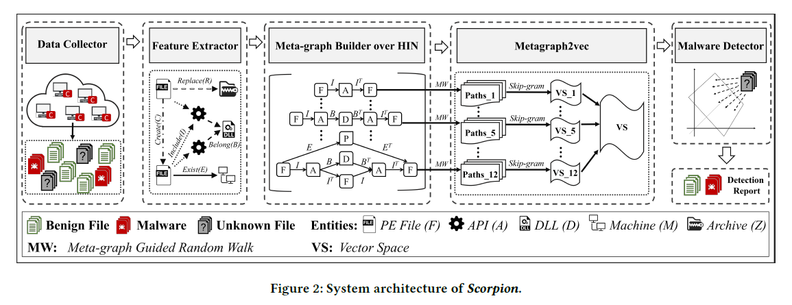
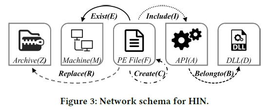

# Gotcha - Sly Malware! Scorpion: A Metagraph2vec Based Malware Detection System 

> 基于Metagraph2vec的恶意软件检测系统，发表于2018年KDD会议。

[TOC]

## ABSTRACT

恶意软件检测越来越得到人们的重视，针对恶意软件检测，论文提出了Scorpion系统。论文使用内容特征和关系特征作为，针对多种类型的实体，论文构建出一个HIN并提出一个新的节点表示方法——metagraph2vec。通过在来自于Comodo Cloud Security Center的数据上的实验，证明Scorpion模型优于其他恶意软件检测技术。

## INTRODUCTION

这部分首先介绍了什么是恶意软件，恶意软件会做些什么，以及恶意软件对社会造成的严重后果。因此引出了恶意软件检测，介绍了一下反恶意软件的现状，并指出**传统的恶意软件检测方法忽视了样本文件间重要的关系信息，即使有些方法有考虑文件间的关系，也只是单独的一种关系**。还有，论文还指出**单单只使用文件内容特征或文件关系特征很可能存在漏洞**，并详细给出了一些例子。

为了解决上述的问题，面对多种复杂的关系，论文使用HIN来表示，并使用基于meta-graph的方法结合高级的语义来表示文件相关性。恶意软件检测是一个速度敏感的应用，大多数神经网络挖掘方法都需要很大的计算量，论文结合神经网络嵌入技术提出了新的HIN embedding的方法metagraph2vec，以最大限度保留结构特征和语义特征。基于这个方法添加一个分类器即可用来检测恶意软件。论文的主要特点有一下这些：

* 使用新的特征表示方法来检测恶意软件，同时使用content-based features和relation features；

* 提出了有效的HIN表示方法，论文基于meta-graph提出新的HIN embedding模型metagraph2vec，并且metagraph2vec是一个通用的框架，可以应用与多种神经网络挖掘任务；
* 为反恶意软件行业开发了实用的系统，在实际的应用中得到了充分的检验；

## SYSTEM ARCHITECTURE

整个系统架构如图，包含如下部分：

* 数据收集；
* 特征提取，首先从收集的特征中提取content-based特征，之后分析不同类型实体间的关系；
* HIN上meta-graph构建，构建出一个包含各种实体的HIN来抓取不同文件之间的关系特征；
* metagraph2vec，基于meta-graph网络结构提出了metagraph2vec，用于整合不同节点间语义信息和结构信息，random walk获取上下文后，使用skip-gram学习节点表示，使用多角度融和算法整合学习到的不同meta-graph的表示；
* 恶意软件检测，使用支持向量机实现分类；

## PROPOSED METHOD

这部分主要介绍模型细节，论文如何同时整合content- and relation-based特征，如何基于节点表示来检测恶意软件。

### Feature Extraction

#### Content-based Features

Windows API接口能有效的反映程序行为。论文从Import Tables中抽取Windows API接口作为content-based特征。

#### Relation-based Features

尽管基于内容的特征能够用来表示一个文件的行为，为了捕捉到一些特殊恶意软件，这些恶意软件和相关软件的固定、复杂的关系对检测有重要作用。为了识别复杂的恶意软件，除了content-based特征，也应该考虑relation-based特征。文件之间的关系主要有以下的定义：

* **R1**：file-replace-archive
* **R2**：file-exist-machine
* **R3**：file-create-file
* **R4**：file-include-API
* **R5**：API-belongto-DLL

### Meta-graph Based Relatedness

为了描述不同类型的实体及其之间的关系（**R1-R5**），论文使用了HIN，HIN可以包含不同类型的实体和关系。

#### Heterogeneous information network（HIN）

一个HIN定义为一个图$\mathcal{G}=(\mathcal{V},\mathcal{E})$，这个图包含一个实体类型映射函数：$\phi : \mathcal{V} \rightarrow \mathcal{A}$和一个关系类型映射函数：$\psi : \mathcal{E} \rightarrow \mathcal{R}$，其中$\mathcal{V}$表示实体集合，$\mathcal{E}$表示关系集合，$\mathcal{A}$表示实体类型集合，$\mathcal{R}$表示关系类型集合，并且存在实体类型$|\mathcal{A}|>1$或者关系类型$|\mathcal{R}|>1$。一个图的**network schema**表示为$\mathcal{T}_\mathcal{G}=(\mathcal{A},\mathcal{R})$，图中的节点类型来自于$\mathcal{A}$，边类型来自于$\mathcal{R}$。下图是论文构建的HIN的network schema。

HIN可以描述数据的网络结构和类别的高级抽象。本文中的数据包含了5种实体类型和5种关系类型，这种复杂的网络结构促使我们使用一种计算机可以理解的表示方式来表示这些不同实体间的语义关系。于是有了**meta-path**的概念：一条meta-path $\mathcal{P}$ 是network schema上的一条路径，表示为$A_{1} \stackrel{R_{1}}{\longrightarrow} A_{2} \stackrel{R_{2}}{\longrightarrow} \ldots \stackrel{R_{L}}{\longrightarrow} A_{L+1}$

#### Meta-graph

### Metagraph2vec	

#### HINRepresentation Learning

#### Meta-graph Guided Random Walk

#### Skip-gram

#### Multi-view Fusion

## EXPERIMENTAL RESULTS AND ANALYSIS

### Experimental Setup

### Evaluation of  Different Meta-graphs

### Evaluation of Metagraph2vec

### Evaluation of Parameter Sensitivity, Scalability and Stability

### Comparisons with Other Traditional Machine Learning Methods

### Comparisons with Anti-malware Products

## SYSTEM DEPLOYMENT AND OPERATION

## RELATED WORK

## CONCLUSION