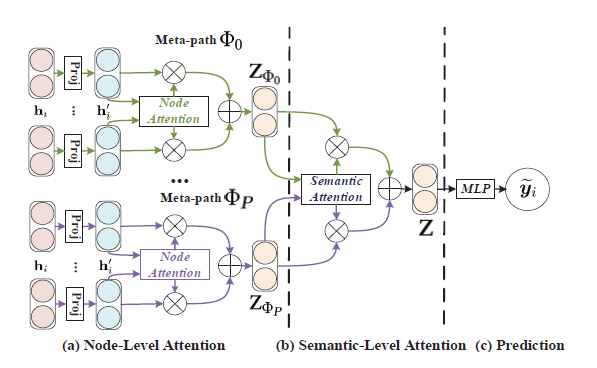
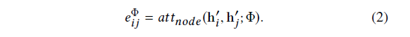
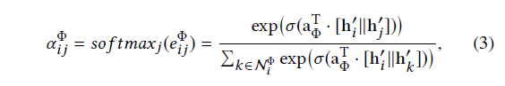
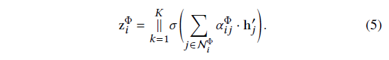
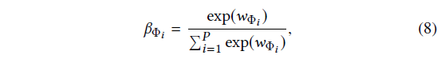
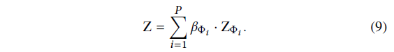
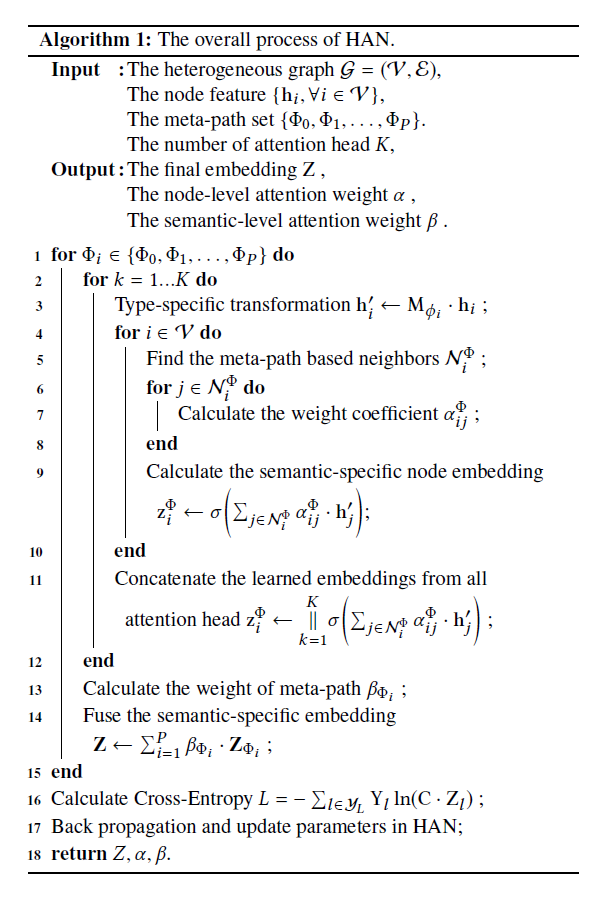

# Heterogeneous Graph Attention Network

[TOC]

> 这篇论文将会发表在WWW 2019会议上。

## ABSTRACT

​	GNN在深度学习领域表现出了强大的性能。但是，在包含不同节点和边的HIN领域，GNN做的还不够完善。论文提出了一种新的异构图神经网络分层注意力机制，涉及到节点级别和语义级别。节点级别的Attention主要学习节点及其临近节点间的权重，语义级别的Attention是来学习基于不同meta-path的权重。

## KEYWORDS

>  **Social Network**, **Neural Network**, **Graph Analysis**

## INTRODUCTION

​	真实世界中的数据往往是复杂的图结构形势，如：社交网络等，网络中包含不同的节点和不同语义的边。

​	这部分介绍了GNN、Attention mechanism、HIN等。由于HIN的复杂性，传统的GNN并不能直接应用于HIN中。这就需要新的方法来解决这个问题，论文提出了HAN模型（Heterogeneous graph Attention Network）。

## RELATED WORK

### Graph Neural Network

​	GNN作为深度学习领域的扩展，用来处理无规则图结构数据。GCN可以分为两类，分别是谱域和非谱域。谱方法用于谱表示的图中，非谱域方法直接在图上进行卷积，对空间上的近邻进行操作。

​	注意力机制在深度学习中有广泛的应用，self-attention、soft-attention等。也已经有很多基于图Attention的应用，但是都是同构图的数据。

### Network Embedding

​	网络嵌入或者网络表示学习，是在保留网络结构及其属性的前提下，将网络转换到低维空间以应用。以往的方法有很多，随机游走、 深度神经网络、矩阵分解等，也都是基于同构图的。

​	异构图的embedding主要关注基于meta-path的结构信息。ESim虽然考虑的多条meta-path的信息，但是在面对具体问题时，无法学习到最优的权重组合；Meta-path2vec通过随机游走和skip-gram算法来做embedding，但是其只考虑了一条meta-path；HERec也是只考虑单条meta-path，通过限制策略来过滤节点序列做embedding；HIN2Vec使用了同时训练节点和meta-path的方法；PME通过欧几里德距离来保留节点的邻接区域；HEER则是通过边表示来做异构图的embedding；Meta-graph2vec最大限度保留了结构和语义信息；还有基于meta-graph的嵌入模型，同时考虑了一个meta-graph的所有元信息的隐藏关系。以上方法都没有使用过Attention mechanism来做graph embedding。

## PRELIMINARY

> **Heterogeneous Graph** : 图G = (V, E) 包含节点集V和连接集E，异构图还包含一个节点映射函数和一个连接映射函数。
>
> **Meta-path**：简单来说即是从节点A到节点B所经过的一系列点的序列。
>
> **Meta-paht based Neighbors**：基于一条meta-path的邻居节点，默认一个节点的邻居节点包括其自身。

​	下图是论文所提出的HAN的架构图。

## THE PROPOSED MODEL

### 	Node-level Attention

​	在具体任务中，一个节点在meta-path上的邻居节点有不同的重要性。Node-level attention能够学习一个节点基于meta-path的邻居节点的表示作为该节点的embedding。由于graph中包含不同类型的node，所以首先通过转换矩阵将所有节点转换到统一的特征空间。

​	给定一个节点对(i , j)，Node-level Attention能学习到节点j相对于节点i的权重，重要的一点是(i , j)的权重是非对称的。

​	通过softmax计算出节点j的权重系数，这里得到的系数也是非对称的。

​	这只是得到一对(i , j)，通过下面的式子聚合所有邻居节点的系数。

​	为了更直观显示聚合过程，论文给出了下图，每个Node的embedding都来自邻居节点。

​	由于异构图数据是scale free的，计算后会有很高的方差，论文通过将Node-level Attention延伸到了Multihead Attention来解决这个问题。紧接着就可以得到Node i 的多条meta-path的embedding集合，即是语义层的embedding，就此Node-level Attention工作完成。

### Semantic-level Attention

​	为了学习到更综合的信息，我们需要根据meta-path将多种语义信息融合到一起。将Node-level Attention的结果作为输入，来学习每条语义的权重。

​	要学习每条语义的权重，论文首先使用一层的MLP将Semantic embedding进行非线性转换。通过Semantic-level Attention vector q 来衡量多条Semantic embedding 间的相似性。

​	经过Softmax函数，得到语义权重。

​	最后，获得的语义层的embedding是这样的。

​	有了embedding之后，我们就可以构建loss function了，论文使用半监督的方式，通过最小化Cross-Entropy来训练。

​	整个过程的算法如下。

### Analysis of the Proposed Model

* HAN能解决异构图中多种Node、Relation，以及Semantic融合的问题；
* 该模型能够并行计算；
* 整个模型的Attention是共享的；
* 具有很好的可解释性；

## EXPERIMENTS

### Datasets

​	实验过程用到了DBLP、ACM、IMDB三个数据集。

### Baselines

​	Baseline包括GCN、GAT、HAN of Node、HAN of Semantic、HAN，从分类、聚类的实验结果来看，HAN基本上都是最优的。

## 论文地址

[Heterogeneous Graph Attention Network](https://arxiv.org/pdf/1903.07293.pdf):https://arxiv.org/pdf/1903.07293.pdf