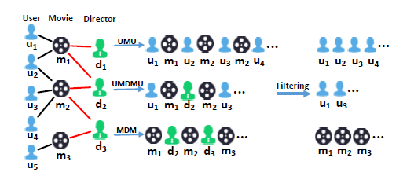
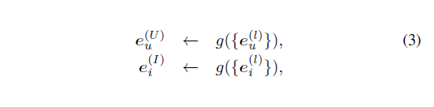
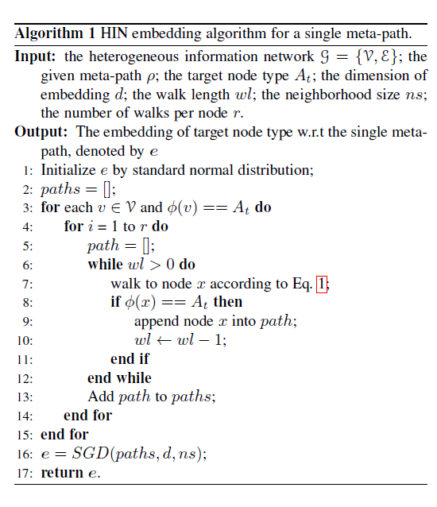
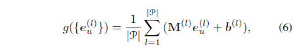
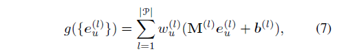
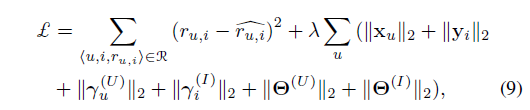
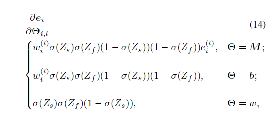
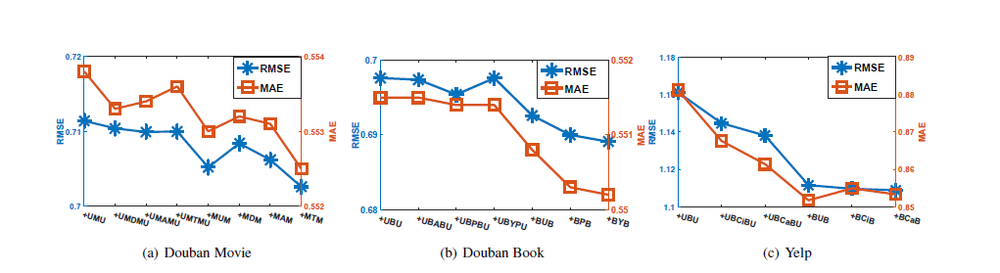
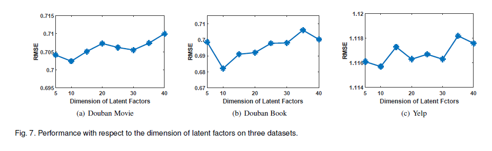

# 用于推荐的异构信息网络嵌入方法Heterogeneous Information Network Embedding for Recommendation

> 这是发表在IEEE2019年的论文。
>
> 作者：Chuan Shi, Member, IEEE, Binbin Hu, Wayne Xin Zhao Member, IEEE and Philip S. Yu, Fellow, IEEE

## Abstract

​		异构信息网络已经在推荐系统中用于表征复杂、异构的数据。基于HIN的推荐是指抽取、开发HIN中的信息。之前的HIN的推荐大多是基于路径相似，论文提出了HERec模型。首先使用Random walk生成network embedding，之后使用matrix factorization和 fusion函数实现预测评分。如图是HERec的架构图。

## Index Terms

> **Heterogeneous information network**, **Network embedding**, **Matrix factorization**, **Recommender system**

## INTRODUCTION

​		这里首先介绍了一下推荐任务的现状、HIN等。并说明了HIN推荐基于路径相似所存在的问题，问题包括HIN中信息的提取，以及在推荐领域的应用开发。

​		为了解决信息抽取的问题，论文在meta-path基础上使用Random walk策略生成节点序列。基于不同的meta-path都会产生一个embedding来表示一个Node，最后融和多个embedding作为HIN embedding。

​		之后就是将HIN embedding应用于推荐系统。论文使用简单线性聚合、个性化线性聚合函数和非线性聚合三种聚合函数来表示一个Node。以此来转换为适用于推荐的信息。最后通过Matrix factorization和fused embedding做预测任务并评分。

​		论文的主要贡献：

* 提出了基于meta-path的HIN embedding的新方法；
* 提出了将HIN应用于推荐的HREec模型；
* 验证了模型的有效性，并展示了模型在冷启动下的能力；

## RELATED WORK

​		这里分三部分介绍了推荐系统、异构信息网络和Network embedding。

​		在推荐系统领域，早期的工作主要围绕协同过滤和历史信息做推荐。矩阵分解在很多应用中也显示出了巨大的效果。由于协同过滤在冷启动方面的缺陷，很多研究都尝试通过附加信息来提升推荐性能，并有了一系列成果，例如randomised SVD、CNN等。

​		HIN是一个新兴的研究方向，HIN能包含复杂的对象和丰富的关系来应用到推荐系统。很多方法都是基于路径相似。后来，基于meta-path的提出，一些新的方法应运而生，meta-path相似、基于meta-path的协同过滤、基于meta-path的矩阵分解。

​		Network embedding在特征提取领域有很大的潜力，在分类、聚类、推荐方面等广泛应用。很多Network embedding都是关注同构网络 ，虽然有一些针对异构网络的embedding，但是node的表示方式对于推荐并不是最适合的。

## PRELIMINARY

​		下面是一些基本定义：

> Definition 1. **Heterogeneous information network**：一个HIN表示为 G = { V , E } ，包含对象集合V和连接集合E。同时，相关的有类型映射函数：f ：V-->A 和 连接映射函数 g ：E --> R。A和R表示预定义的对象集合和连接集合，同时|A|+|R| > 2。
>
> Definition 2. **Network schema**：它表示HIN结构的元类型，用来抽象表示整个HIN结构。论文所使用数据集的Network schema如图。
>
> 
>
> Definition 3. **Meta-path**：一个meta-path表示从节点A到B所经过一系列Node的路径。
>
> Definition 4. **HIN based recommendation**：推荐系统中往往只关注user、item这两个实体的关系，其中user、item都包含于对象集合A中，用三元组{u，i，ru,i}表示用户u对实体i的评价r，这个关系属于集合R。

## THE PROPOSED APPROACH

### Heterogeneous Network Embedding

​		给定一个HIN，我们的目标是为每一个Node学习一个低维embedding，这个embedding高度凝结信息特点，能够应用于推荐方法。Deep walk这个开创性研究使用了random walk生成节点序列，但是并不能区分边的类型。这就需要更细化的方法来转化HIN生成有意义的节点序列。

#### Meta-path based Random Walk

​		要实现上面的需求，就需要设计一个有效的walking策略。论文提出来基于meta-path的random walk策略。

#### Type Constraint and Filtering

​		因为是要应用于推荐领域，我们只关注user和item，对于HIN出现的其他对象并没有什么兴趣。因此，论文只选择了那些user类型或item类型作为起点的meta-path。一个节点序列可能会包含不同类型的节点，这就要删除那些跟开始节点不同的节点。这样做的好处在于，将一个HIN转化为了一个同构网络，降低了实现难度。再一个，给定一个定长的窗口，使用同类型的节点来表示一个Node比不同类型的节点表示一个Node更有意义。下图是整个过滤过程。

#### Optimization Objective

​		根据node2vec，论文使用如下方式作为表示节点的优化目标。

#### Embedding Fusion

​		根据论文模型，给定一个Node，我们可以获得一系列meta-path的random walk的表示。这就需要我们将这些embedding融和为适合应用与推荐的的一个embedding，一般方法是使用一个线性权重机制来组合权重。论文提出使用一个function g(*)来融和节点信息。

​		这里并没有指出这个函数g(*)是什么样式的，论文认为针对特定的任务，网络应该学习出特定的function。

​		这里给出整个HIN embedding部分的算法。

### Integrating Matrix Factorization with Fused HIN Embedding for Recommendation

​		根据前面的方法，我们已经能够得到User embedding和Item embedding，接下来就是使用这些embedding做推荐。

#### Rating Predictor

​		论文基于经典的MF模型构建评分模型。在MF中，用户 u 对物品 i 的定义如下：

​		其中Xu和Yi分别是相应的user和item。我们有user和item的表示，则Rating Predictor如下：

​		注意：这里的隐式因子 r 跟user embedding、item embedding有相同的维度。

#### Setting the Fusion Function

​		之前，我们假设fusion function是一个给定的形式，这里就来学习如何设置这个function。论文只阐述了user embedding的fusion function的构建过程，item 的类似。一共有三种fusion function。

* Simple linear fusion：这里假设user对每条meta-path有相同的偏爱度，所以给定每条meta-path相同的权重，并将embedding线性转换到目标空间；

* Personalized linear fusion：Simple 的方式不能表示user对meta-path的个性化需求，所以这里给每个user分配一个权重矩阵，用来表示user的个性化需求，这在真正应用中显得更为合理；

* Personalized non-linear fusion：线性的fusion一定程度限制了对复杂关系数据的拟合能力，这是非线性fusion的形式；

#### Model Learning

​		将fusion function整合到MF中如下：

​		上面的参数会按如下更新：

​		其中Θ表示fusion function中的所有参数，不同的Θ的导数计算也不相同，其中Personalized non-linear fusion function的导数计算如下：

​		其中Zs为原函数，Zf为激活部分。整个算法框架如下：

#### Complexity Analysis

​		论文模型主要包含两部分：

* HIN embedding：其复杂度主要包含User、Item embedding的维度与两者个数、meta-path条数有关。
* Matrix Factorization：主要是更新一系列参数，SGD在训练中收敛迅速。

## EXPERIMENTS

​		论文使用Douban Movie、Douban Book、Yelp三个数据集来实验。下图是三个数据集中选用的相应的meta-path。

​		论文使用的评估指标有MAE（mean absolute error）、RMSE（root meansquare error），计算方式如下：

​		作为对比的baseline包括：PMF、SoMF、FMHIN、HeteMF、SemRec、DSR、HERecdw、HERecmp，最后结果显示，论文模型几乎全部表现最优。

#### Selection of Different Fusion Functions

​		论文还对fusion function进行了对比实验，结果显示非线性最优、线性次之、simple最差。

#### Cold-start Prediction

​		论文针对冷启动问题作了对比实验，从结果看出HERec依旧表现很好。

#### Impact of Different Meta-Paths

​		此外，论文分析了meta-path的条数对推荐效果的影响，并分析了一下其中的原因。并得出结论：少量的优质meta-path能够最大化性能，这也能有效控制模型复杂度。

#### Parameter Tuning

​		最后，论文还对参数的选择进行了分析，分别分析了隐式因子个数对结果的影响、权重参数α、β对结果的影响，以及迭代次数对结果的影响。

* **隐式因子个数对结果的影响**

* **权重参数α、β对结果的影响**

* **迭代次数对结果的影响**

## 论文地址

[**Heterogeneous Information Network Embedding for Recommendation**](<https://arxiv.org/pdf/1711.10730>): https://arxiv.org/pdf/1711.10730